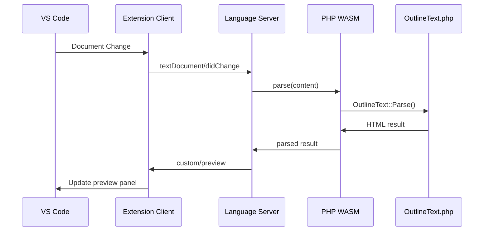

# OutlineText LSP + WASM Architecture

## 新しい拡張機能構造

```
vscode-outlinetext/
├── client/                     # VS Code Extension (Client)
│   ├── src/
│   │   ├── extension.ts       # Main extension entry
│   │   ├── client.ts          # LSP client
│   │   ├── preview.ts         # Preview panel
│   │   └── commands.ts        # Commands
│   └── package.json
│
├── server/                     # Language Server
│   ├── src/
│   │   ├── server.ts          # LSP server main
│   │   ├── parser.ts          # WASM parser integration
│   │   ├── cache.ts           # Parse cache
│   │   └── diagnostics.ts     # Error diagnostics
│   └── package.json
│
├── wasm/                       # WASM Resources
│   ├── php/
│   │   ├── OutlineText.php    # Parser from ContentsPlanet
│   │   └── lsp-wrapper.php    # LSP wrapper
│   └── libs/                  # WASM binaries (downloaded)
│
└── shared/                     # Shared types
    └── types.ts               # LSP message types
```

## メッセージフロー



## 実装フェーズ

### Phase 1: LSP Basic Setup
1. package.json dependencies
2. Basic LSP server
3. Client-server communication

### Phase 2: WASM Integration  
1. PHP WASM loading
2. Parser integration
3. Error handling

### Phase 3: Advanced Features
1. Preview panel
2. Diagnostics
3. Performance optimization